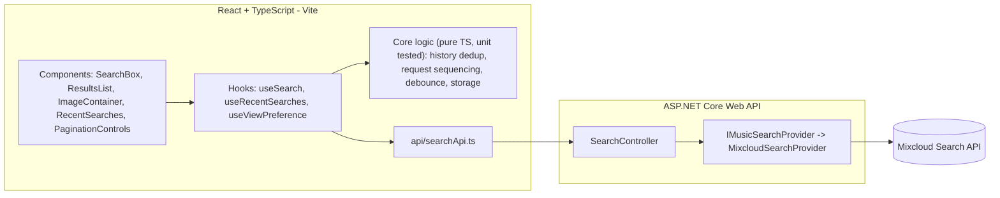

# Sound Search

**Live app:** _TODO - add the deployed frontend URL here once deployment is complete (see [Deployment](#deployment))._
**Live API:** _TODO - add the deployed backend URL here._

A Mixcloud-powered track search app: search, page through results 6 at a
time, fly a result into a central player, and embed/autoplay it — with a
history of your last 5 searches remembered across visits.

Built with a **React + TypeScript** frontend and a thin **ASP.NET Core**
backend-for-frontend (BFF) that talks to the [Mixcloud API](https://www.mixcloud.com/developers/).

## Contents

- [Architecture](#architecture)
- [Project layout](#project-layout)
- [Running locally](#running-locally)
- [Testing](#testing)
- [Deployment](#deployment)
- [Design decisions & trade-offs](#design-decisions--trade-offs)

## Architecture



The frontend never talks to Mixcloud directly — it only knows about our own
backend's normalized JSON shape. All Mixcloud-specific knowledge (URLs, JSON
layout, pagination) lives behind a single `IMusicSearchProvider` interface
on the backend, so a different Sound API could be plugged in by writing one
new provider class, without touching the controller, DTOs, or any frontend
code.

### Backend (`/backend`)

`SoundSearch.Api` is a minimal ASP.NET Core 9 Web API with one endpoint:

- `GET /api/search?q={term}&limit=6` — a new search, first page.
- `GET /api/search?cursor={opaqueToken}` — the next/previous page of a
  search already in progress.

Key pieces:

- **`Providers/IMusicSearchProvider.cs`** — the swappable seam. `SearchByTermAsync`,
  `SearchByCursorAsync`, and `IsSupportedCursor` are all a provider needs to implement.
- **`Providers/MixcloudSearchProvider.cs`** — the only class that knows Mixcloud's
  URLs/JSON. Uses `IHttpClientFactory` for outbound calls.
- **`Providers/MixcloudResponseMapper.cs`** — pure mapping from Mixcloud's raw JSON to
  our normalized `TrackResult`, unit tested directly with hand-built payloads.
- **`Cursors/CursorCodec.cs`** — turns Mixcloud's own `paging.next`/`paging.previous`
  URLs into an opaque, base64-url token for the client and back again. This is what
  lets pagination use **the API's real paging cursor instead of a hand-rolled offset**:
  the backend never recomputes `offset=`, it just replays whatever URL Mixcloud handed
  it. Decoded cursors are validated against `IMusicSearchProvider.IsSupportedCursor`
  before being used, so a tampered/forged cursor can't be used to make the server
  fetch an arbitrary URL (basic SSRF protection).
- **`Controllers/SearchController.cs`** — validates input, delegates to the provider,
  encodes/decodes cursors, and turns provider failures into a `502` `ProblemDetails`
  response so the frontend has something concrete to show and retry.

### Frontend (`/frontend`)

- **`src/api/`** — a typed fetch client (`searchApi.ts`) for *our* backend only, plus
  the shared `TrackResult`/`SearchResponse`/`ApiError` types. No `any` anywhere.
- **`src/core/`** — framework-agnostic, unit-tested business logic with zero React or
  DOM dependency beyond `AbortController`:
  - `history.ts` — `addSearchTerm`: dedups case-insensitively, moves a re-searched
    term to the top, caps the list at 5.
  - `storage.ts` / `recentSearchesStorage.ts` / `viewPreference.ts` — a small
    `KeyValueStore` interface wrapping `localStorage` (swappable for an in-memory
    fake in tests, or a different backing store later).
  - `debounce.ts` — a reusable debounce with `cancel()`.
  - `searchController.ts` — the async-correctness core (see below).
- **`src/hooks/`** — thin React glue (`useSearch`, `useRecentSearches`,
  `useViewPreference`) that wires the core logic into component state.
- **`src/components/`** — presentational, composable components: `SearchBox`,
  `ResultsList`/`ResultItem` (list *and* tile layouts), `PaginationControls`,
  `RecentSearches`, `ImageContainer`, and the loading/empty/error states.

#### Correct async handling

`SearchController` (in `src/core/searchController.ts`) is the piece responsible for
requirement #7 in the spec. Every search-triggering action (typing, Next, Previous,
clicking a recent search) goes through it:

- Starting a new request **aborts** whatever request was in flight (`AbortController`).
- Every request is tagged with a monotonically increasing **request id**.
- A response (success *or* error) is only applied to state if its request id is still
  the most recent one — so a slow, now-stale response can never clobber a newer one,
  even if it resolves *after* a newer request has already started (the classic
  "mash Next/Previous" race).
- Typing is debounced ~300ms via `debounce.ts`; explicit submit (Enter, the Go
  button, or clicking a recent search) cancels the pending debounce and searches
  immediately.

This class has no framework dependency, so it's unit tested in isolation
(`searchController.test.ts`) by manually controlling when each fake request
resolves, in whatever order the test wants — including "the old request resolves
after the new one".

#### The "fly to the image" interaction

The result thumbnail and the big image in `ImageContainer` share a Framer Motion
`layoutId`. Selecting a result removes the thumbnail from the list (fading that slot
out) while mounting the same `layoutId` in `ImageContainer` — Framer Motion
automatically animates the shared element between the two positions/sizes, and the
destination image fades/scales in on arrival. Focus moves to the new "Play" button
once the track changes, and `MotionConfig reducedMotion="user"` disables the
transform-based part of the animation for users with `prefers-reduced-motion` set,
falling back to a plain crossfade.

## Project layout

```
.
├── backend/
│   ├── SoundSearch.Api/            ASP.NET Core Web API
│   └── SoundSearch.Api.Tests/      xUnit tests
├── frontend/
│   └── src/
│       ├── api/                    typed client for our backend
│       ├── core/                   framework-agnostic logic (unit tested)
│       ├── hooks/                  React glue over core/ + api/
│       └── components/             presentational UI
├── backend/Dockerfile              container build for the API
└── render.yaml                     Render deploy blueprint for the API
```

## Running locally

### Prerequisites

- [.NET SDK 9](https://dotnet.microsoft.com/download)
- [Node.js 20+](https://nodejs.org/) and npm

### 1. Backend

```bash
cd backend
dotnet run --project SoundSearch.Api --urls http://localhost:5080
```

The API is now at `http://localhost:5080` (try `http://localhost:5080/api/search?q=adele`).
CORS defaults to allowing `http://localhost:5173` (the frontend's dev port); override
with the `AllowedOrigin` environment variable (comma-separated for multiple origins).

### 2. Frontend

```bash
cd frontend
npm install
cp .env.example .env.local   # already points at http://localhost:5080
npm run dev
```

Open the URL Vite prints (typically `http://localhost:5173`).

## Testing

```bash
# Backend - 16 xUnit tests (cursor codec, Mixcloud response mapping, controller)
cd backend
dotnet test

# Frontend - 35 Vitest tests (debounce, history, storage, view preference,
# the SearchController race/cancellation logic, and the useSearch hook)
cd frontend
npm test
```

## Deployment

The spec requires a live, publicly reachable URL (not `localhost`) at the top of this
README. Both halves deploy on free tiers:

### Backend → Render

1. Push this repo to GitHub (already done if you're reading this on GitHub).
2. On [Render](https://render.com), choose **New → Blueprint** and point it at this
   repo — it will pick up [`render.yaml`](render.yaml) and build `backend/Dockerfile`
   automatically. (Or create a **New → Web Service** manually with *Runtime: Docker*,
   *Dockerfile path:* `backend/Dockerfile`, *Docker build context:* `backend`.)
3. Once deployed, note the service URL (e.g. `https://soundsearch-api.onrender.com`).
4. Set the `AllowedOrigin` environment variable on the Render service to your Vercel
   frontend's URL once you have it (step below), then redeploy.

### Frontend → Vercel

1. On [Vercel](https://vercel.com), **Add New → Project**, import this repo.
2. Set **Root Directory** to `frontend` (framework preset: Vite).
3. Add an environment variable `VITE_API_BASE_URL` = your Render backend URL from above.
4. Deploy, then copy the resulting `https://…vercel.app` URL:
   - into Render's `AllowedOrigin` (step 4 above), and
   - into the top of this README.

## Design decisions & trade-offs

- **Why a .NET backend at all, when the spec only requires a frontend?** Requirement
  #10 asks for the data source to be swappable "by touching the data layer" only.
  Putting Mixcloud's request/response shape behind an ASP.NET Core BFF makes that
  literal: the entire provider-specific surface is one interface implementation, and
  the React app only ever sees our own normalized JSON contract.
- **Recent-search history and List/Tile preference live in `localStorage`**, not on
  the server — they're per-browser preferences, not per-account data, and the spec's
  "available for the user in subsequent visits" is naturally satisfied by that scope.
  Swapping in a server-backed store later only means changing `core/storage.ts`.
- **Cursors are Mixcloud's own paging URLs, opaque-encoded** — never a
  hand-computed offset. If Mixcloud changes how its pagination works internally,
  nothing on either side of this app needs to change.
- **6 results per page, `limit` clamped server-side** to that value regardless of
  what a client requests, so the "only fetch 6 at a time" rule can't be bypassed by
  calling the API directly.
